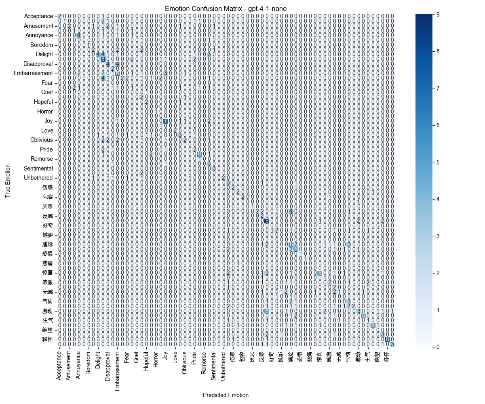
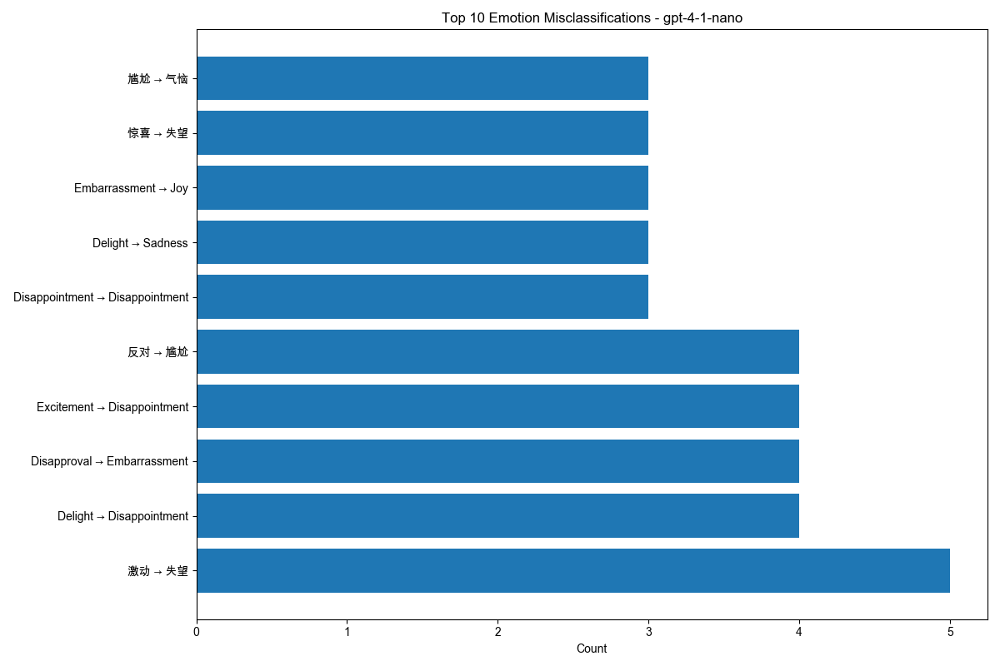
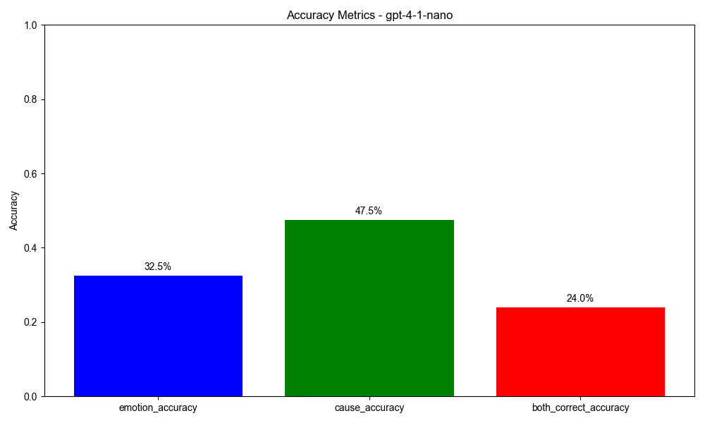

# Emotional Understanding Experiments

This project tests the emotional understanding capabilities of large language models (like GPT-4.1-nano) using the EU.jsonl dataset to evaluate how well models can identify emotions and their causes.

## Key Features

- Configure different GPT models via environment variables (.env)
- Automatically create separate results directories for each model
- Resume testing from interruption points
- Visualize model performance including confusion matrices and misclassification analysis
- Compare results across multiple models

## Environment Setup

### Prerequisites

1. Clone this repository
2. Create and activate the conda environment:

```
make env
conda activate agir-eu
```

3. Configure API key and model:

```
cp .env-example .env
```

Edit the `.env` file to add your OpenAI API key and the model you want to test:

```
OPENAI_API_KEY=your_openai_api_key_here
GPT_MODEL=gpt-4.1-nano
```

## Usage

### Run Complete Test

```
make run
```

### Limit Number of Test Records

```
make run-limit limit=10
```

This will test only the first 10 records.

### Resume Testing from Previous Interruption

```
make resume limit=20
```

This will resume testing from where it left off, processing 20 records at a time.

### Analyze Test Results

Analyze results from all models:
```
make analyze
```

Analyze results from a specific model:
```
make analyze-model model=gpt-4-1-nano
```

Compare performance across all models:
```
make compare-models
```

### Recreate Environment

If you need to recreate the conda environment:

```
make recreate-env
conda activate agir-eu
```

## Result Analysis

Test results are saved in `results/{model-name}/results.jsonl` files, organized by model name. Analysis results are stored in the `results/analysis/{model-name}/` directory.

### GPT-4.1-nano Test Results

Testing was conducted on a dataset of 400 emotional understanding scenarios, with the following results:

| Metric | Accuracy |
| --- | --- |
| Emotion Identification Accuracy | 32.5% |
| Emotion Cause Identification Accuracy | 47.5% |
| Both Correct | 24.0% |

#### Emotion Confusion Matrix



#### Common Emotion Misclassifications



#### Accuracy Metrics



## Dataset Information

The EU.jsonl dataset contains a series of emotional scenarios, each with a subject and corresponding correct emotion and cause labels. The testing evaluates the model's understanding of:

1. Identifying the subject's correct emotional state
2. Identifying the correct cause of that emotional state

## Project Structure

```
.
├── results/                  # Results storage directory
│   ├── gpt-4-1-nano/         # Results organized by model name
│   └── analysis/             # Analysis results and visualizations
├── src/                      # Source code
│   ├── main.py               # Main testing script
│   ├── check_env.py          # Environment checking script
│   └── analyze_results.py    # Results analysis script
├── EU.jsonl                  # Test dataset
├── .env-example              # Environment variable example file
├── environment.yml           # Conda environment configuration
└── Makefile                  # Project command wrapper
```

## Contributing

Issue reports, feature requests, and pull requests are welcome.